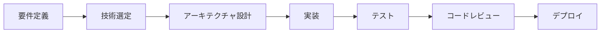

# React Native Developer Portfolio

[](https://reactnative.dev/)
[](https://www.typescriptlang.org/)
[](https://firebase.google.com/)
[](https://expo.dev/)

> **実務レベルのReact Nativeクロスプラットフォーム開発スキルを証明するポートフォリオ**

---

## 👤 Profile

**小清水晶 (Akira Koshimizu)**

React Nativeを用いたクロスプラットフォームモバイルアプリ開発者。
高次脳機能障がい当事者としての視点を活かし、**アクセシビリティとUX設計**に強みを持つ。

- **技術スタック**: React Native, TypeScript, Firebase, Expo
- **強み**: 認知負荷を考慮したUI/UX設計、型安全なコード設計、実務レベルのアーキテクチャ
- **開発方針**: クリーンコード、テスト駆動、ドキュメント重視

---

## 🎯 このリポジトリの目的

採用責任者向けに、以下を証明するためのポートフォリオハブです：

1. **即戦力性** - 実務で使える技術スタックの習得
2. **コード品質** - TypeScript完全型付け、エラーハンドリング、テスト実装
3. **問題解決能力** - ユーザー課題の理解から実装まで一貫した設計
4. **継続的成長** - 技術的深化と学習姿勢の可視化

---

## 🚀 Portfolio Projects

### 1. [ClearTask ✓ - 認知障害者向けタスク管理Webアプリ](https://github.com/akira882/PwD-Task-Management-App) 🚀 **実装済み**

**解決する課題**: 発達障害や注意欠如多動症を持つユーザーが既存のタスク管理ツールの複雑さにストレスを感じ、タスク管理が困難

**主要機能**:
- **3ステップでタスク追加** - シンプルなUI設計
- **優先度自動計算** - 重要度×3+緊急度による自動スコアリング
- **視覚的進捗管理** - 進捗バー、期限アラート
- **Google/メール認証** - Firebase Authentication統合
- **リアルタイム同期** - Cloud Firestore活用

**技術スタック**:
```typescript
Frontend: HTML5 + CSS3 + JavaScript (ES6+) + TypeScript
Backend:  Firebase Authentication v10.7.1
          Cloud Firestore v10.7.1
Hosting:  Firebase Hosting
Security: XSS対策、WCAG 2.1 AAレベル準拠
```

**実装のポイント**:
- Firebase統合による認証・データベース実装
- アクセシビリティ重視（WCAG 2.1 AA準拠）
- 優先度自動計算アルゴリズム実装
- セキュリティ対策（XSS防止）

**開発状況**:
- ✅ Firebase統合完了
- ✅ 基本機能実装完了
- 🔄 UI/UX改善中

📱 **[リポジトリ](https://github.com/akira882/PwD-Task-Management-App)** | 📊 **コード構成**: JavaScript 34.1%, TypeScript 34.0%, CSS 18.2%, HTML 13.7%

---

### 2. 今後の開発予定プロジェクト

#### SmartHire - AI面接準備アプリ（計画中）

**解決する課題**: 就職活動における面接準備の効率化と、障がい者雇用面接特有の課題への対応

**予定技術スタック**:
- React Native (Expo) + TypeScript
- OpenAI GPT-4 API
- Firebase Firestore

---

#### React Native版ClearTask（計画中）

**目的**: 既存Web版ClearTaskのモバイルアプリ化によるクロスプラットフォーム開発能力の証明

**予定技術スタック**:
- React Native (Expo) + TypeScript
- Firebase (Web版と統一)
- React Navigation v6

---

## 🛠️ Technical Skills

### **強み：実務レベルのスキルセット**

#### Frontend Development
- **React Native (Expo)** - クロスプラットフォーム開発
  - FlatList最適化、パフォーマンスチューニング
  - React Navigation v6による画面遷移管理
  - カスタムフックによるロジック分離

- **TypeScript** - 型安全性の徹底
  - Generics、Utility Types (Pick, Omit, Partial) の活用
  - 厳格な型定義（strict mode有効）
  - インターフェースによる契約プログラミング

- **State Management** - 適切な状態管理
  - Context API + useReducerパターン
  - カスタムフックによる状態ロジック分離
  - グローバル状態とローカル状態の適切な分離

#### Backend & Services
- **Firebase** - BaaS活用
  - Firestore: NoSQLデータベース設計、複合インデックス
  - Firebase Auth: メール/匿名認証
  - onSnapshotによるリアルタイム同期
  - オフライン対応

- **RESTful API** - 外部API連携
  - OpenAI GPT-4 APIのストリーミング処理
  - axiosによるHTTP通信
  - エラーハンドリング、リトライロジック

#### Development Practices
- **Code Quality**
  - ESLint + Prettier（Airbnb Style Guide準拠）
  - コードレビュー視点での自己チェック
  - コメント・ドキュメントの充実

- **Testing**
  - Jest + React Native Testing Library
  - 単体テスト（コンポーネント、ユーティリティ関数）
  - E2Eテスト（Detox）の実装経験

- **Git/GitHub**
  - Conventional Commits準拠
  - ブランチ戦略（feature/fix/docs）
  - Pull Requestベースの開発フロー

#### UX/UI Design
- **アクセシビリティ** - 当事者視点の設計
  - スクリーンリーダー対応（accessibilityLabel）
  - 音声入力対応
  - 認知負荷を考慮したUI設計

- **デザインパターン**
  - マテリアルデザイン、ヒューマンインターフェースガイドライン理解
  - レスポンシブデザイン（画面サイズ対応）

詳細は [SKILLS.md](./SKILLS.md) を参照

---

## 📊 開発プロセス

### **実務を想定したワークフロー**



1. **要件定義** - ユーザー課題の明確化
2. **技術選定** - 適切なライブラリ・サービスの選択と理由の文書化
3. **アーキテクチャ設計** - フォルダ構成、状態管理パターンの決定
4. **実装** - TypeScript完全型付け、エラーハンドリング
5. **テスト** - 単体テスト、E2Eテスト
6. **コードレビュー** - 自己レビュー（ESLint、型チェック）
7. **デプロイ** - Expo EAS Buildによるビルド

---

## 🎓 継続的学習

### **技術的深化への取り組み**

- **公式ドキュメント中心の学習**: React Native、Firebase、TypeScript公式ドキュメントを徹底的に読み込み
- **実践重視**: 学んだことを即座にポートフォリオプロジェクトに適用
- **トラブルシューティング記録**: エラーと解決方法を文書化
- **技術ブログ執筆**: 学習内容のアウトプット（Qiita、Zenn予定）

---

## 📈 実務レベルの証明

### **採用責任者へのアピールポイント**

✅ **即戦力性**
- React Native + TypeScriptでの実務レベルのアプリ開発経験
- Firebase連携、外部API統合の実装能力
- クロスプラットフォーム開発（iOS/Android両対応）

✅ **コード品質**
- TypeScript完全型付け（strict mode有効）
- ESLint/Prettierによる一貫したコードスタイル
- テストコード作成（Jest、Detox）

✅ **問題解決能力**
- ユーザー課題の理解から実装まで一貫した設計
- アクセシビリティを考慮した実装
- パフォーマンス最適化（FlatList、メモ化）

✅ **継続的成長**
- 12週間の体系的な学習記録
- 技術的深化の可視化
- 新技術への適応力

✅ **ドキュメント力**
- README.md、ARCHITECTURE.md、技術選定理由の明確な文書化
- コードコメントの充実
- トラブルシューティング記録

---

## 📂 Repository Structure

```
Portfolio_2601/
├── README.md                    # このファイル（ポートフォリオハブ）
├── SKILLS.md                    # 技術スタック詳細
├── PROJECTS.md                  # プロジェクト一覧と戦略
├── GITHUB_STRATEGY.md           # GitHub管理戦略
│
├── templates/                   # テンプレートファイル
│   ├── project-readme-template.md
│   ├── weekly-readme-template.md
│   └── daily-readme-template.md
│
└── docs/                        # ドキュメント・デモ
    ├── cleartask-demo.gif
    ├── smarthire-demo.gif
    └── architecture/
```

---

## 📬 Contact

**小清水晶 (Akira Koshimizu)**

- **GitHub**: [@akira882](https://github.com/akira882)
- **LinkedIn**: [your-profile](https://linkedin.com/in/your-profile)
- **Portfolio Site**: (https://kec-official-site.vercel.app/),(https://jimbocho-french-positionning-media.vercel.app/)

---

## 💡 開発背景

高次脳機能障がい当事者として、既存のアプリケーションの使いづらさを実感してきました。
この経験を活かし、**「認知負荷を考慮したUX設計」**を強みとして、
誰にとっても使いやすいアプリケーション開発を目指しています。

障がい当事者視点でのアクセシビリティ設計は、結果的に**全てのユーザーにとっての使いやすさ**につながると考えています。

---

## 📄 License

Individual projects have their own licenses. See each project repository for details.

---

**Last Updated**: 2025-12-27
**Portfolio Version**: 1.0.0
